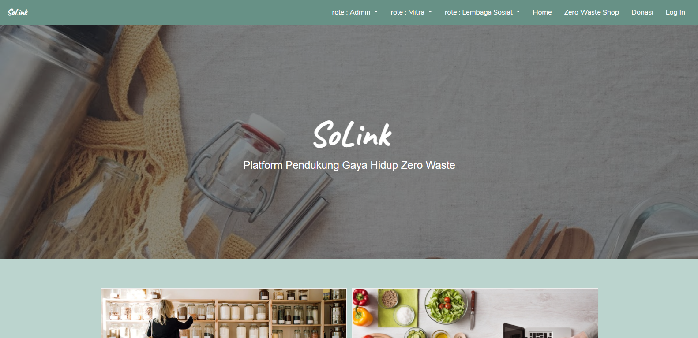

  
# SoLink
SoLink adalah platform yang mendukung gaya hidup zero waste. SoLink hadir dalam bentuk website yang dapat kamu akses <a href="https://tkrpl-kel7.herokuapp.com/" ><b>disini</b></a>

## Author
Aji Inisti Udma Wijaya - 1806141126  
Muhamad Adhytia Wana P. - 1806141321  
Muhammad Ihsan Azizi - 1806186774  
Ronaldi Tjaidianto - 1806141441  

## Pengerjaan UCRS
##### Aji
UCRS Mengelola Barang  
UCRS Melihat Barang
##### Adhytia
UCRS Melakukan Donasi  
UCRS Melihat Riwayat Donasi
##### Ihsan
UCRS Mengelola Artikel  
UCRS Melihat Artikel
##### Ronaldi
UCRS Transaksi Pembelian  
UCRS Melihat Riwayat Transaksi Pembelian
